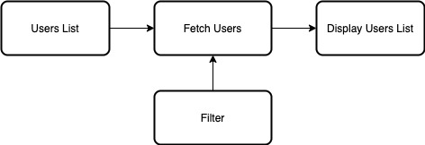

# Zoominfo Web Development Exam

## Repository Content

### Client
Angular application with 2 pages (components):
* `Login` - login form
* `Users` - dynamic list of users

### Client Components
#### Main Component


#### Login Component


#### Users Component


### Server
Express web server (Node.js) with 2 end-points:
* `/login`
* `/users`

#### Login Flow


#### Users Flow


# Tasks
## 1 Prepare your environment
1. Open terminal (cli) and clone this repository:
   ```shell script
   git clone  https://github.com/Zoominfo/wd-exam.git
   ```
2. Navigate to the `client` directory and install its dependencies:
   ```shell script
   cd wd-exam/client
   npm i
   ```
3. Open another terminal window and install dependencies for the `server` too.

4. In each terminal window, start applications using the following command:
   ```shell script
   npm start
   ```
   You can leave the applications run during the exam. Any change you'll make to the code will be reloaded automatically.
   You can restart applications by running the same command again.

## 2 Login Form
Implement login form in `login.component.html` file. Each field should have input validation.
* Email field (email should be valid)
* Password field (password should not be empty)
* Login button

Sample form:


### Bonus
1. Display validation status
2. Use colors to mark invalid input
3. Login button should be disabled for invalid form


## 3 Login bug
Login action is an *HTTP POST* request to the server with email and password as payload. Hitting "Login" button with the right credentials is not working. Find and fix this bug.

Hints:
* Login function in the client is implemented in `app.service.ts`.
* Login function in the server is implemented in `routes/login.js`.


## 4 Unable to fetch users bug
While trying to fetch users lists from the server, we get an error instead of users list.
Find the reason it refuses to fetch data and fix it.

Hints:
* The `/users` end point is guarded by a middleware allow only logged in users to access the users' data.


## 5 Filtering users
The `Users` page contain a filter field. Implement the filter mechanism to fetch only users contain the filter in their name.

## 6 Sorting users (Bonus task)
Make the users table sortable.


# Finishing Exam
When finishing your exam, delete `node_modules` directory from `client` and from `server` directory, 
compress the project into `zip` file and send it to `ziv.perry@zoominfo.com`.
